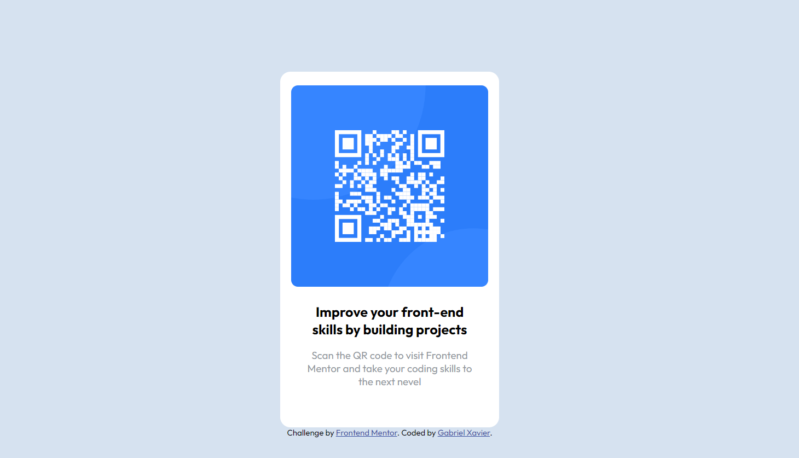

 #  Frontend Mentor - Solução do desafio QR Code Component

QR Code feito a partir do desafio do  <a href='https://www.frontendmentor.io/challenges/qr-code-component-iux_sIO_H'>FrontEnd Mentor<a> 

## Índice

- <a href="#-demonstracao">Demonstração</a>
- <a href="#-tecnologia">Tecnologia ultilizadas</a>
- <a href="#-aprendendo">O que estou aprendendo </a>
- <a href="#-passos">Próximos passos</a>
- <a href="#-autora">Pessoa Autora </a>

## 💿Demostração 
[Clique aqui para acessar](https://gabriel-xavier1.github.io/Frontend-Mentor-QR-code-component/)

## ⚙️Tecnologias Ultilizadas 

- Html
- Css
- Git e Github

## 🧠O que estou aprendendo

Estou aprendendo a usar o flexbox e colocar a imagem dentro da div e centralizar os elementos. 

## 👟Próximos passos

Testei meus conhecimentos de Flexbox e algo a ser aprimorado, sendo assim continua criando projetos com Flexbox para maior compreensão.

## ✒️Pessoa Autora 
- Frontend Mentor - https://www.frontendmentor.io/profile/gabriel-xavier1

